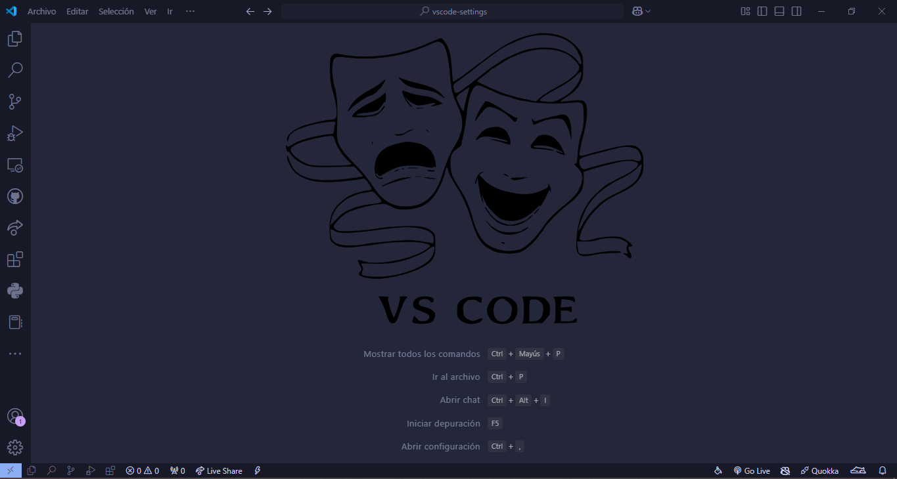
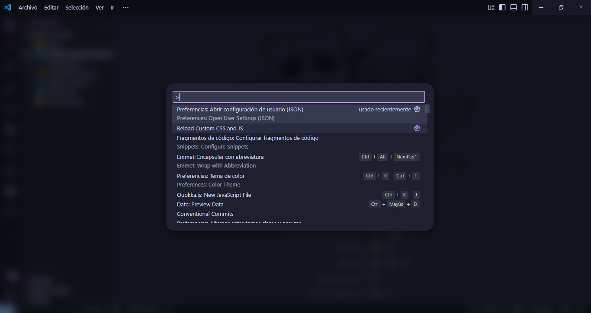

# Vscode Configuración

## 💻 Instrucciones
1. Instalar la extensión `Custom CSS and JS Loader`
2. Agregar en el settings.json el `vscode_custom_css.imports`, editando la ruta donde se encuentra la carpeta para windows (en la descripción de la extensión muestra la manera para linux/mac):
``` json
    "vscode_custom_css.imports": [
    "file:///F:/ruta-donde-esta-la-carpeta/vscode-settings/custom-vscode.css",
    "file:///F:/ruta-donde-esta-la-carpeta/vscode-settings/vscode-script.js"
    ]
```
3. En la paleta de comandos (alt+shift+p) buscar la opción `Reload Custom CSS and JS` y reiniciar.
 
## 🎨 Modificaciones
1. Cambio de la imagen inicial



2. Paleta de comandos

